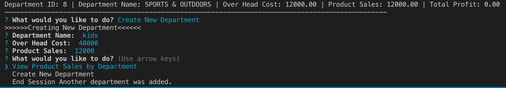
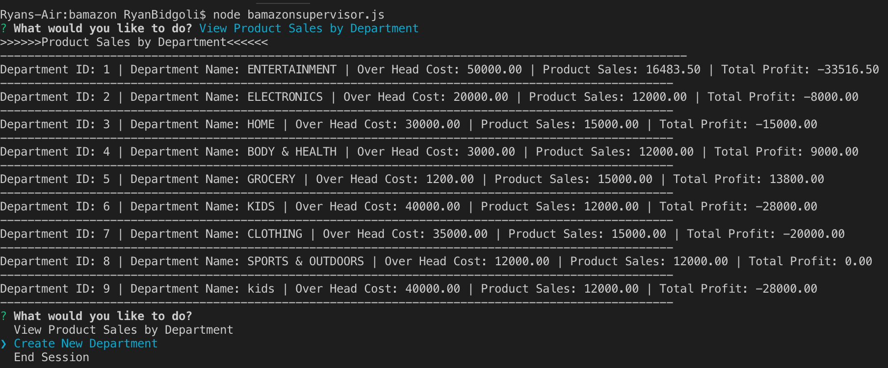
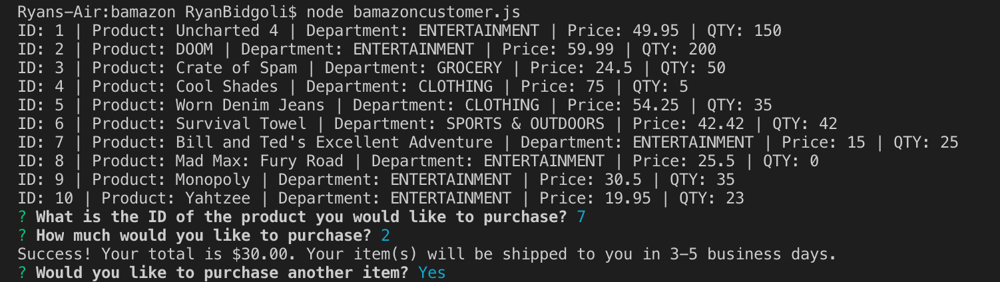
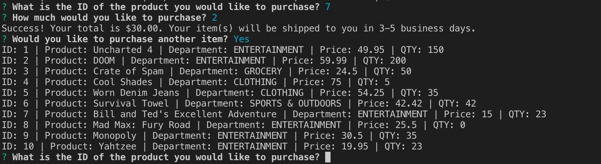
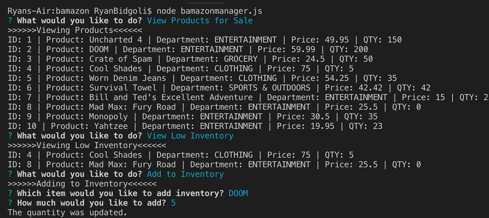
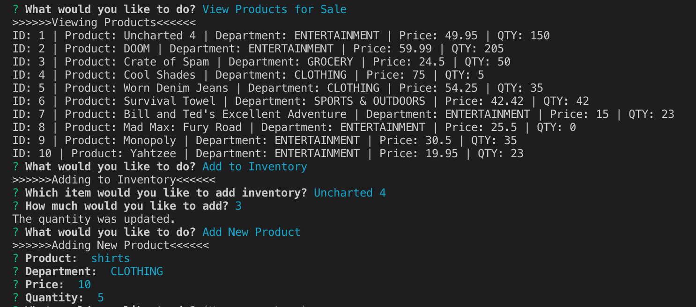

# bamazon

## Technologies used:
- Node.js
- Inquire NPM Package  
- MYSQL NPM Package

### JS file functions:

1. `Bamazoncustomer.js`

    * Prints the products in the store.

    * Prompts customer which product they would like to purchase by ID number.

    * Asks for the quantity.

      * If there is a sufficient amount of the product in stock, it will return the total for that purchase.
      * However, if there is not enough of the product in stock, it will tell the user that there isn't enough of the product.
      * If the purchase goes through, it updates the stock quantity to reflect the purchase.
      * It will also update the product sales in the department table.
      -----------------------

## Screenshots:

